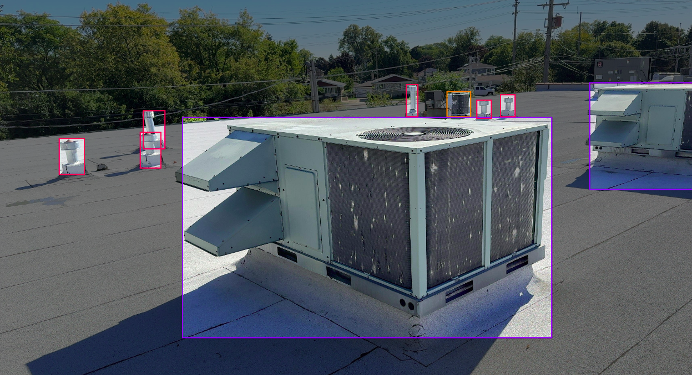

# HVAC Test (309 Technology)

 This is a solution for the AI dev evaluation process. The solution implements Roboflow for data annotation, YOLOv11 for object detection, FAST API for REST API and Docker for containerization. This solution doesn't look for optimization since results overcome minimum requirement and model is light and for sure you have a better model with better annotation, so this README will explain some reasoning behind the raw solution.

---

## Contents

-  [EDA & Data Annotation](#eda--data-annotation)
-  [Training Process](#training)
-  [REST API](#rest-api)
-  [Installation](#Installation)
-  [Demo](#Demo)

---
## EDA & Data Annotation
First of all, by analyzing the data, you could infere that it was raw data from phone cameras. Some images were extracted from a video sequence without skipping frames. So it was very likely to find duplicates. At the moment of the downloading, the total amount of images were about 8000> images. So for cleaning data, it was used perceptual hash that consists on a sequential resampling of the image converted to grayscale [See the data cleaning notebook](HVAC_test.ipynb#eda) or [this blog](https://apiumhub.com/tech-blog-barcelona/introduction-perceptual-hashes-measuring-similarity/). Furthermore, a simple iterative rename of the files were performed for easier handling when annotating. This cleaning of the data gave around 3000 duplicated images that were deleted after.

To label the data, I used Roboflow. Due to time restrictions, 500 images were labeled, trying to balance each classes. The total classes were 4: hvac-label, hvac-rtu, vent-unit and vent. Data augmentation was performed using the tool from Roboflow having >1000 images. The train/val/test split followed the convention 70/20/10. The dataset can be seen [here](https://universe.roboflow.com/notfound/hvac-test-km6yv).

> **NOTE:** To be honest, I'm not used to HVAC units. When reviewing the images, most devices seemed similar to me, that's why there's only a class as **hvac-rtu** which stands for HVAC-roof-top-unit. Other classes such as **vent** are any flexible metal ventilation pipe. **vent-unit** are the ones that look alike a air-conditioner.

---
## Training

For the training process, the default hyperparameters provided by YOLOv11 nano were used. The main reason for this choice is simplicity and time constraints: the goal of this task is to demonstrate a working object detector for HVAC units, not to achieve state-of-the-art performance.

>                  Class     Images  Instances      Box(P          R      mAP50  mAP50-95): 100% ━━━━━━━━━━━━ 2/2 1.5it/s 1.3s
>                   all        100        246      0.802      0.649      0.715      0.563
>            hvac-label         20         23      0.866      0.739      0.831      0.687
>              hvac-rtu         70        107      0.823      0.832      0.896      0.704
>                  vent         35         90      0.686      0.268      0.304      0.188
>             vent-unit         21         26      0.831      0.758      0.828      0.673
>Speed: 0.2ms preprocess, 2.9ms inference, 0.0ms loss, 2.6ms postprocess per image

Above is a summary of some metrics in the training process. Overall, it has a good mAP50 which is the one ask in the task. However we can see that in some classes the score is higher than others. The one that is bad is the **vent** class, and this has a reason. That's because the quality of labels in this class was not the optimal. Since I assumed any flexible pipe that seems to be part of any ventilation system belong to this class, so it was difficult to find a pattern as seen in the figures here below in red bounding boxes.




Moreover, here we can see some results metrics. From the graph below, losses decrease steadily and metrics improve without signs of overfitting. The model reaches mAP50 around 0.7 and mAP50-95 around 0.5, with precision/recall around 0.6. However, this could be improved with more labeled data, stronger data augmentation, or hyperparameter tuning (lr, batch size, epochs) to further boost precision and mAP50-95


> **NOTE:** This model wasn't optimized neither transformed in onnx format since it has few parameters and, since, it meets real time requirement. This can be useful for further analysis in development, however it also requires to have install torch in the environment increasing the size of the container. So its a cost-balance problem. In this case, minimum requirement is performed and no further optmization isn't required.

---
## REST API

For the API, FAST API was used. The base code for the API was in inspired by open-source [FastAPI + YOLO repositories on GitHub](https://github.com/Raafat-Nagy/YOLO-Object-Detection-App.git), adapting the structure to fit the requirements of this task.

The API exposes two main endpoints:

- `POST /detect/`: Accepts an image or video file and returns either an annotated image (JPEG) or a JSON with a video stream URL, depending on the file type.
- `GET /video_stream/{uid}`: Streams annotated video frames as MJPEG, allowing real-time visualization of detections.

Error handling is implemented to ensure clear feedback for invalid files, unsupported formats, or missing resources.

---
## Installation

1. **Clone this repo**
   ```bash
   git clone https://github.com/manul30/hvac-test.git
   cd hvac-test
   ```
2. **Build docker container**
   ```bash
   docker compose up --build
   ```
---

## Demo

When running the container, go to http://0.0.0.0:8000/

📸 Here’s how it works:

[]


